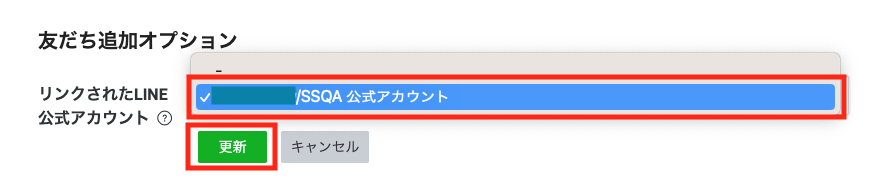
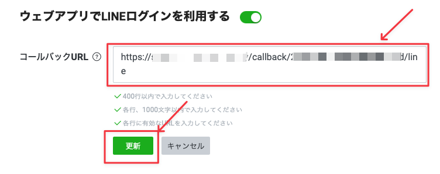
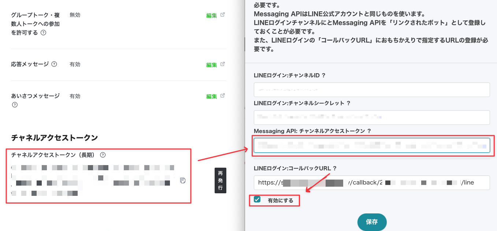

おもちかえり.com と お店のLINE公式アカウント の連携方法

2023/9/26 の更新により、飲食店様のLINE公式アカウントからお客様に対して、注文の受理、注文の準備完了の通知ができるようになりました。(注意: 1注文につき2通分、メッセージ通数にカウントされます。参考URL LINE公式アカウント料金プラン https://www.lycbiz.com/jp/service/line-official-account/plan/)

この記事ではLINE公式アカウントをもっている飲食店様向けに設定方法を説明します。

## 1. LINE 公式アカウントの管理画面 での設定
- LINE 公式アカウントの管理画面にログインします。
- `設定` を押します。  
	
- `Messaging API` を押します。  
	
- `Messaging API を利用する` ボタンを押します。  
	
- プロバイダー名（飲食店名など）を入力し、`同意する` ボタンを押します。  
	> 参考: お客様の画面はこのように表示されます。  
	> 

	既存のプロバイダーを利用する場合は、該当するプロバイダーを選択してください。  
	
- プライバシーポリシーと利用規約のURLを入力して、`OK` ボタンを押します。任意なので空欄でも大丈夫です。  
	
- 最終確認をして、`OK` ボタンを押します。  
	

## 2. LINE Developers での設定
### 2.1. 新規チャネル作成
LINE公式アカウントとは別に、LINE Developers というサイトがあります。今回はこの LINE Developers 上での設定方法について説明します。  

- LINE Developers にログインします。  
	URL: https://account.line.biz/login?redirectUri=https%3A%2F%2Fdevelopers.line.biz%2Fconsole%2F
- ログインするとコンソール画面になります。  
- 項番1 で作成したプロバイダー名を選択します。  
	
- 項番1 で設定したLINE公式アカウント名が表示されていることを確認します。  
	
- `新規チャネル作成` ボタンを押します。  
	
- `新規チャネル作成` に必要な情報を入力します。
  - **チャネルの種類**:	LINEログイン
  - **プロバイダー**:	今回作成したもの
  - **サービスを提供する地域**:	日本
  - 会社・事業者の所在国・地域:	飲食店様の情報を選択
  - チャネルアイコン:	任意。飲食店様の情報を登録します。
  - **チャネル名**:	入力必須。飲食店様の情報を登録します。
  - **チャネル説明**:	入力必須。飲食店様の情報を登録します。
  - **アプリタイプ**:	ウェブアプリにチェックを入れます。
  - 2要素認証の必須化:	任意
  - **メールアドレス**: 飲食店様の情報を登録します。
  - プライバシーポリシーURL: 任意。飲食店様の情報を登録します。
  - サービス利用規約URL: 任意。飲食店様の情報を入力を登録します。
  - LINE開発者契約の内容に同意します: 内容を確認の上、チェックします。

	> 参考: お客様にはこのように表示されます。  
	> チャネルアイコン:	紫枠  
	> チャネル名:	赤枠  
	> チャネル説明:	青枠  
	> 

　上記入力後に `作成` ボタンを押します。
	

### 2.2. チャネル設定
#### 2.2.1. チャネル基本設定
- 項番2.1 の設定が完了すると以下の画面が表示されます。  
	
- このページの下段の `友だち追加オプション` の項目の`編集`ボタンを押します。  
	
- 飲食店様のLINE公式アカウントを選択して、`更新` ボタンを押します。  
	

- ここで一度、おもちかえり.com 管理画面を`別タブ`または`別ウインドウ`で開きます。

#### 2.2.2. おもちかえり.com 管理画面
- 店舗情報より `LINE連携` ボタンを押します  
	
- `LINEログイン:コールバックURL` をコピーします  
	
- 先ほどの `LINE Developers > プロバイダー名 > チャネル名(LINEログイン)` に戻ります。

#### 2.2.3. LINEログイン設定
- `LINEログイン設定` を選択します。  
	
- `コールバックURL` の `編集` ボタンを押します。  
	
- 先ほどおもちかえり.com 管理画面でコピーした `コールバックURL` をペーストして、`更新` ボタンを押します。  
	
- LINE Developers 側の設定はこれで終了です。  
	次は LINE Developers の情報をコピーして、おもちかえり.com の管理画面へペーストする作業です。

## 3. LINE Developers から おもちかえり.com 管理画面 へ転記
### 3.1. LINE Developers 側の準備
- これまでに利用していた `LINE Developers > プロバイダー名 > チャネル名(LINEログイン)` の `チャネル基本設定` を選択します。  

	

### 3.2. おもちかえり.com 側の準備
- 項番2.2.2 と同様に `管理画面 > 店舗情報 > LINE連携` にします。  
	

### 3.3. チャネルID / チャネルシークレット の転記
LINE Developers 側のチャネル名(LINEログイン)の

  - 上段: チャンネルID
  - 下段: チャネルシークレット  

を、おもちかえり.com へコピー & ペーストします。  

- 次は LINE Developers側の作業です。

### 3.4. LINE Messaging API 
- 今回作成した `Provider 名` を選択します。  
	

- `LINE公式アカウント名 (Messaging API)` を選択します。  
	

- `Messaging API設定` を選択します。  
	

- `チャネルアクセストークン(長期)` の `発行` ボタンを押します。  
	

- `チャネルアクセストークン（長期）`を、おもちかえり.com へコピー & ペーストします。その後、`有効にする` にチェックを入れて `保存` ボタンを押します。  
	
