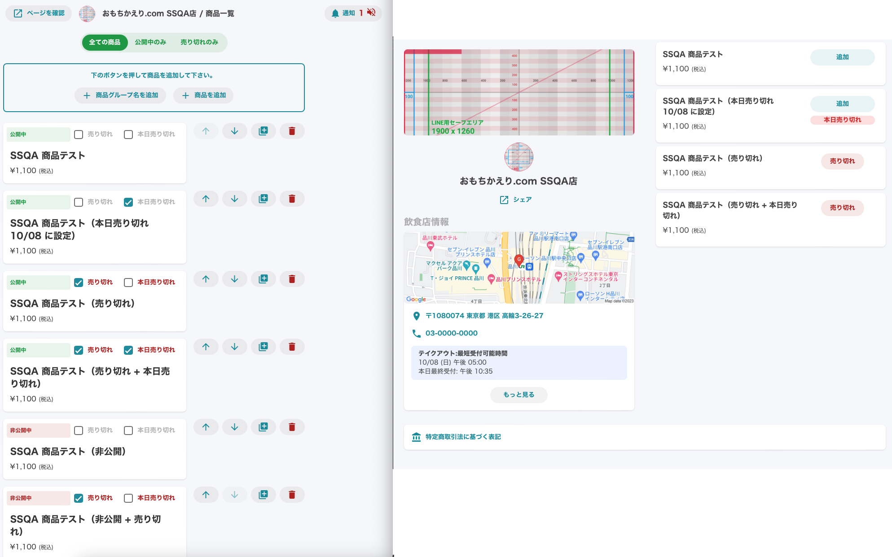
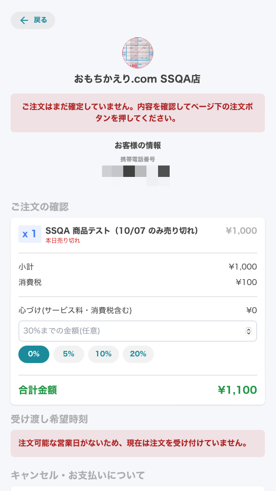
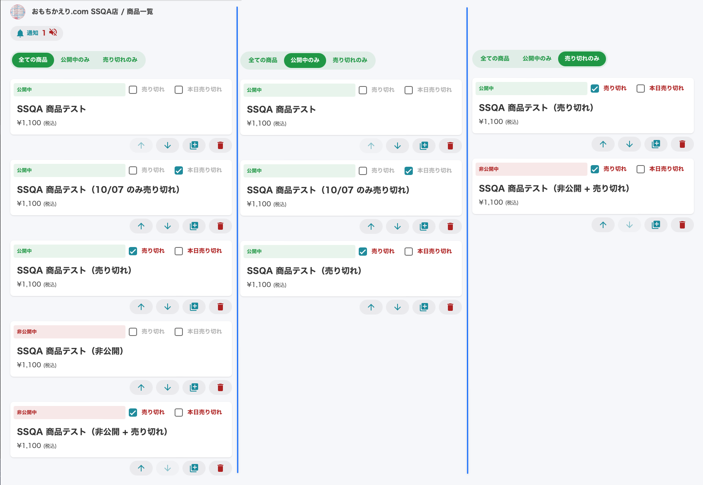

# 商品一覧に売り切れのみ表示、本日売り切れ機能追加 <!-- omit in toc -->

2023/9/26 のアップデートで
- 商品の「本日売り切れ」を追加
  - 当日の注文を終了したい時に利用します。翌日になると自動的に注文受付を再開します。  
- 商品一覧に「売り切れのみを表示」を追加  
  - `売り切れ` 設定の解除をしたい商品を探しやすくするために、`売り切れのみ表示` 機能を追加しました。

が追加されました。  

この記事では今回追加した機能とこれまで機能を合わせて紹介します。

- [1. 「本日売り切れ」と「売り切れ」機能の違い](#1-本日売り切れと売り切れ機能の違い)
- [2. 商品一覧 \> 商品の設定](#2-商品一覧--商品の設定)
	- [2.1. 注意](#21-注意)
- [3. 商品一覧の表示切り替え機能](#3-商品一覧の表示切り替え機能)

# 1. 「本日売り切れ」と「売り切れ」機能の違い
まず初めに、今回追加した`本日売り切れ` と `売り切れ` 機能の違いを説明します。
- 本日売り切れ（今回追加した機能）
  - 商品ごとに設定します
  - 当日の注文は終了したいが、明日以降の注文は受け付けたい時に利用します
  - 翌日になると自動的に注文受付を再開します
- 売り切れ
  - 商品ごとに設定します
  - 注文を終了したい時に利用します
  - 注文受付の再開は手動で設定します

# 2. 商品一覧 > 商品の設定
本日売り切れ、売り切れ、公開/非公開設定をするとお客様の画面がどのように変わるのか紹介します。  
管理画面では下の表のように5種類の設定をしました。

| No | 商品名                             | 公開/非公開 | 売り切れ  | 本日売り切れ    |
| -- | ----------------------------      | :---: | :---:   | :---: |
| 1  | SSQA 商品テスト                    | 公開   |         |     |
| 2  | SSQA 商品テスト (10/07 のみ売り切れ) | 公開   |         | ☑️    |
| 3  | SSQA 商品テスト (売り切れ)          | 公開   | ☑️       |     |
| 4  | SSQA 商品テスト (非公開)            | 非公開  |        |     |
| 5  | SSQA 商品テスト (非公開 + 売り切れ)   | 非公開  | ☑️       |     |

お客様画面では下の図のように表示されます。左が管理画面で、右がお客様の画面です。一つずつ説明します。

1. お客様画面では`公開`している商品のみ表示され、`非公開` の商品は表示されません。
2. 管理画面上で`本日売り切れ` をチェックすると、お客様画面では `追加` ボタンの下に `本日売り切れ` と表示さます。
3. 管理画面上で`売り切れ` をチェックすると、お客様画面では追加ボタンがなくなり、`売り切れ` と表示されます

## 2.1. 注意
`当日のみ予約可能` に設定している状態で、`本日売り切れ` の設定にすると、お客様にはこのように表示されます。

- 商品はカートに入れられる
- 注文確認画面までは操作可能
- しかし、`注文確認画面` の `受け渡し希望時刻` に `注文可能な営業日がないため、現在は注文を受け付けていません。` と表示され注文できない状態になる

# 3. 商品一覧の表示切り替え機能
今回追加した機能により3種類の表示方法ができるようになりました。  
`売り切れ` 設定の解除をしたい商品を探しやすくするために、`売り切れのみ表示` 機能を追加しました。

- 全ての商品
- 公開中のみ
- 売り切れのみ

