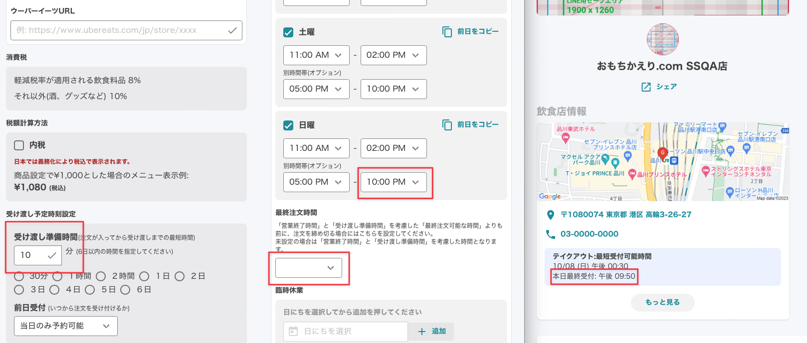

# 最終注文時間 <!-- omit in toc -->

2023/9/26 のアップデートで
- 「最終オーダー時間」の設定

が追加されました。  

この記事では今回追加した機能とこれまで機能を合わせて紹介します。

- [1. 最終注文時間の設定場所](#1-最終注文時間の設定場所)
- [2. 最終注文時間を設定しない場合](#2-最終注文時間を設定しない場合)
- [3. 最終注文時間を設定する場合](#3-最終注文時間を設定する場合)

# 1. 最終注文時間の設定場所
最終注文時間の設定は
`店情報の変更 > 営業日時設定 > 最終注文時間`
で行います。

この機能は「営業終了時間」と「受け渡し準備時間」を考慮した「最終注文可能な時間」よりも前に、注文を締め切る場合にはこちらを設定してください。

# 2. 最終注文時間を設定しない場合
まず初めに最終注文時間を設定しない場合について説明します。

この例では以下の通り設定しております。
- 受け渡し予定時刻設定 > 受け渡し準備時間: 10分
- 営業時間: 5:00 PM〜 10:00 PM
- 最終注文時間: 設定なし
  
すると、お客様の画面の `本日最終受付` は、午後 9:50と表示されます。

# 3. 最終注文時間を設定する場合
次に最終注文時間を設定する場合について説明します。
前項では設定しなかった `最終注文時間` を 9:00 PM に設定します。

この例では以下の通り設定しております。
- 受け渡し予定時刻設定 > 受け渡し準備時間: 10分
- 営業時間: 5:00 PM〜 10:00 PM
- 最終注文時間: 9:00 PM
  
すると、お客様の画面の `本日最終受付` は、午後 9:00と表示されます。
このように「営業終了時間」と「受け渡し準備時間」を考慮せずに、注文を早く締め切りたい場合に、 `最終注文時間` の機能をご利用ください。

