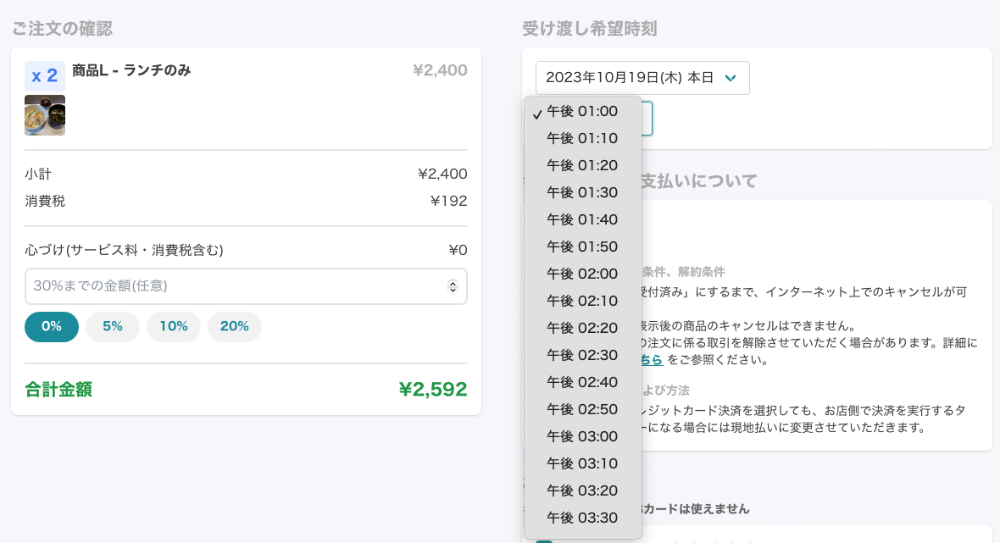
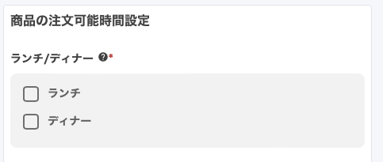
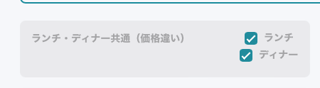

# ランチ/ディナー切り替え <!-- omit in toc -->

2023/9/26 のアップデートで
- ランチとディナーでメニューを切り替え

が追加されました。  

この記事では今回追加した機能とこれまで機能を合わせて紹介します。

- [1. ランチ/ディナー切り替え機能とは](#1-ランチディナー切り替え機能とは)
	- [1.1. 営業時間](#11-営業時間)
	- [1.2. ランチ/ディナー切り替え](#12-ランチディナー切り替え)
	- [1.3. 注文ページ](#13-注文ページ)
- [2. ランチ/ディナー切り替え機能の設定方法](#2-ランチディナー切り替え機能の設定方法)
	- [2.1. 店情報の変更](#21-店情報の変更)
	- [2.2. 商品および商品グループの設定](#22-商品および商品グループの設定)
		- [2.2.1. 商品](#221-商品)
		- [2.2.2. 商品グループ](#222-商品グループ)
	- [2.3. 同一商品でランチ/ディナーの価格を変更する方法](#23-同一商品でランチディナーの価格を変更する方法)

# 1. ランチ/ディナー切り替え機能とは
まず初めに、ランチ/ディナー切り替え機能を有効にすると、お客様が見るページがどのように変わるのかを説明します。

## 1.1. 営業時間
営業時間の横にランチ/ディナーの文字が表示されます。  

## 1.2. ランチ/ディナー切り替え
メニューの上部にランチ/ディナーの切り替えボタンが表示されます。  

ランチ/ディナーボタンを切り替えると、
- 赤枠のように、ランチ/ディナーのみの商品、商品グループの切り替え
- 青枠のように、同じ商品名で価格を変える

をすることができます。

## 1.3. 注文ページ
受け渡し希望時刻はランチ/ディナーそれぞれの営業時間内で受け渡しになります。

- ランチ商品の場合  
	

- ディナー商品の場合  
	

# 2. ランチ/ディナー切り替え機能の設定方法
次に、ランチ/ディナー切り替え機能の設定方法について説明します。

## 2.1. 店情報の変更
管理画面でランチ/ディナー機能を有効化します。

- 管理画面にて `店情報の変更` を選択します。
- 営業日時設定 > `ランチ/ディナーの自動切り替え` にチェックを入れます  
	
	
- 全曜日にランチ/ディナーの時間がセットされているか確認します  
	

- `保存` ボタンを押します。

## 2.2. 商品および商品グループの設定
ランチ/ディナー機能を有効にしたら、商品および商品グループの設定をします。

### 2.2.1. 商品
商品ごとにランチ/ディナー設定をします。デフォルトではランチ/ディナー共通として登録されています。

- 商品の注文可能時間設定 > ランチ/ディナー
  - ランチのみにしたいとき  
		
  - ディナーのみにしたいとき  
		
  - ランチ/ディナー共通にしたいとき  
		  
		または  
		  

### 2.2.2. 商品グループ
商品グループごとにランチ/ディナー設定をします。デフォルトではランチ/ディナー共通として登録されています。

商品グループ名の横のチェックボックスでランチ/ディナーの設定を行います。  
下の図はランチ/ディナー共通の商品グループの時の設定です。  
  

設定方法は商品のランチ/ディナー設定と同様に設定します。
- ランチのみにしたいとき
  - ランチのチェックボックスのみ選択する
- ディナーのみにしたいとき
  - ディナーのチェックボックスのみ選択する
- ランチ/ディナー共通にしたいとき
  - ランチとディナーのチェックボックス両方とも選択  
		または
  - ランチとディナーのチェックボックス両方を外す

## 2.3. 同一商品でランチ/ディナーの価格を変更する方法
- 商品グループ
  - ランチ/ディナー共通
- 商品
  - 商品A
    - 価格X
    - ランチのみ
  - 商品A
    - 商品A を複製して
    - 価格X から Y へ変更
    - ランチのみをディナーのみへ変更

上記の設定をすることで、ランチ/ディナーの切り替え時に同一商品で異なる価格の設定が可能です。

  
