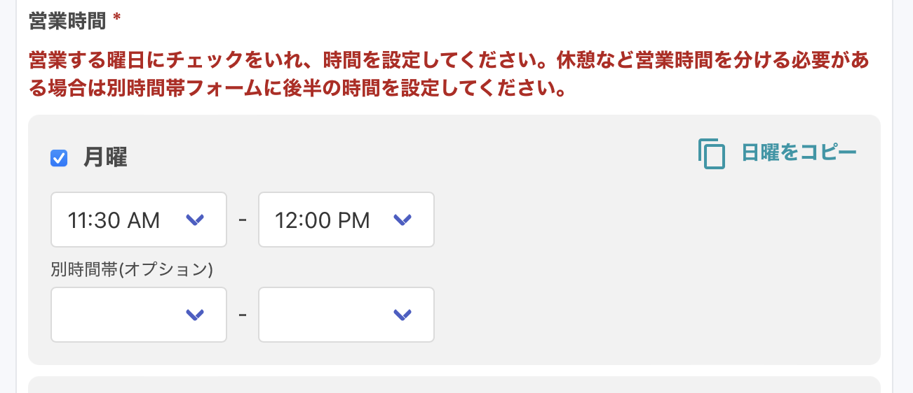
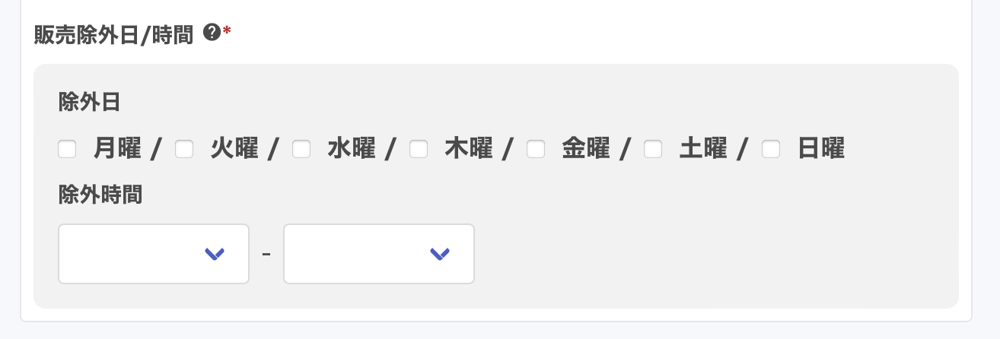
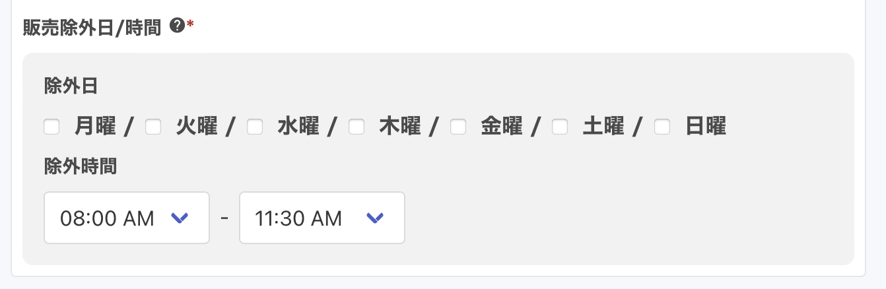
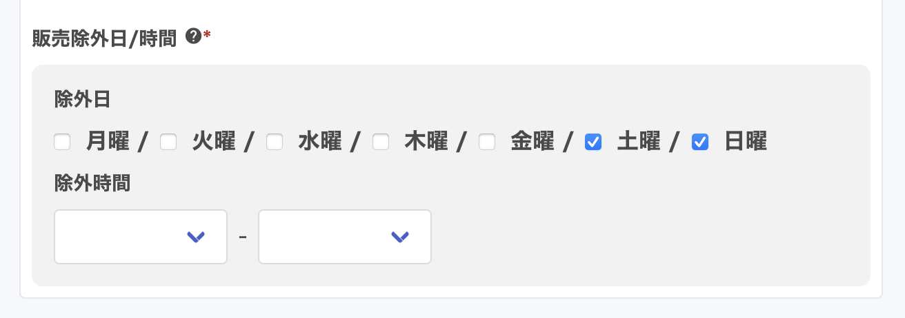
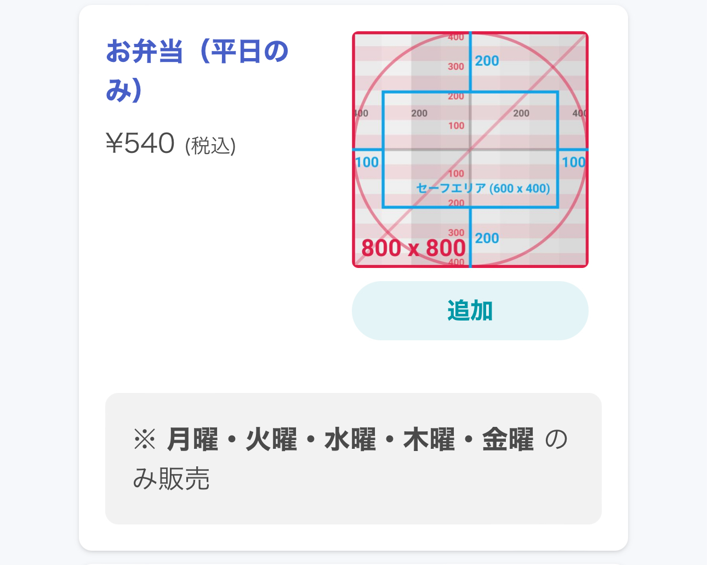
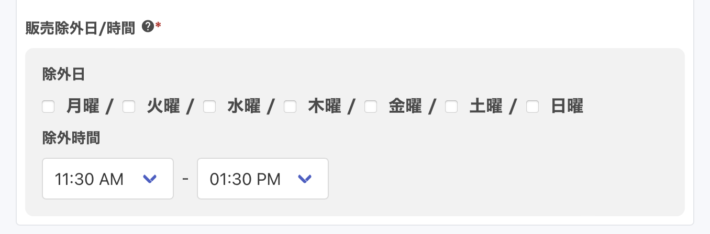
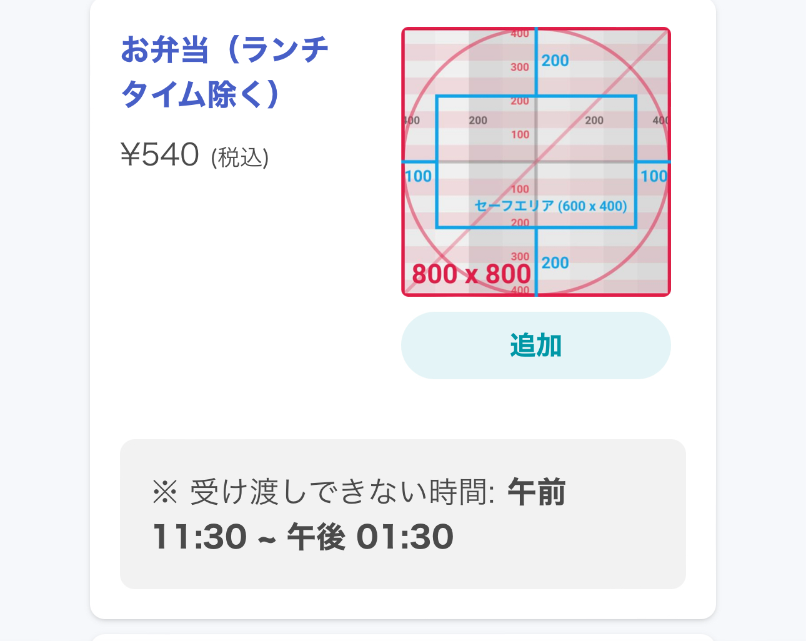
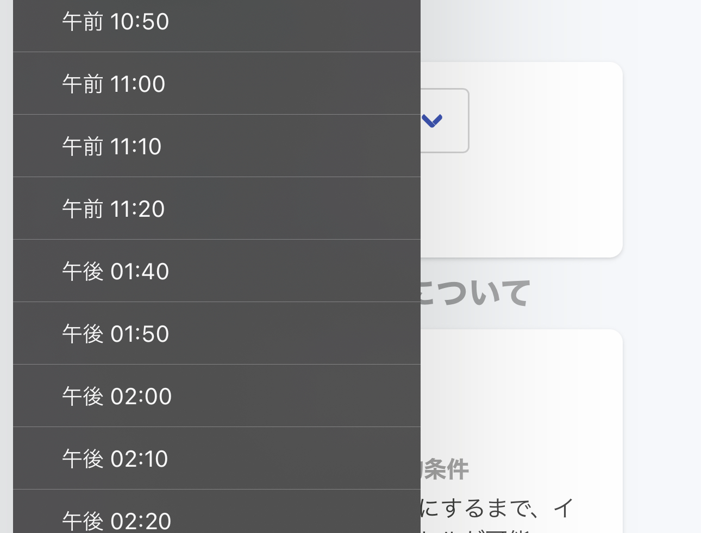
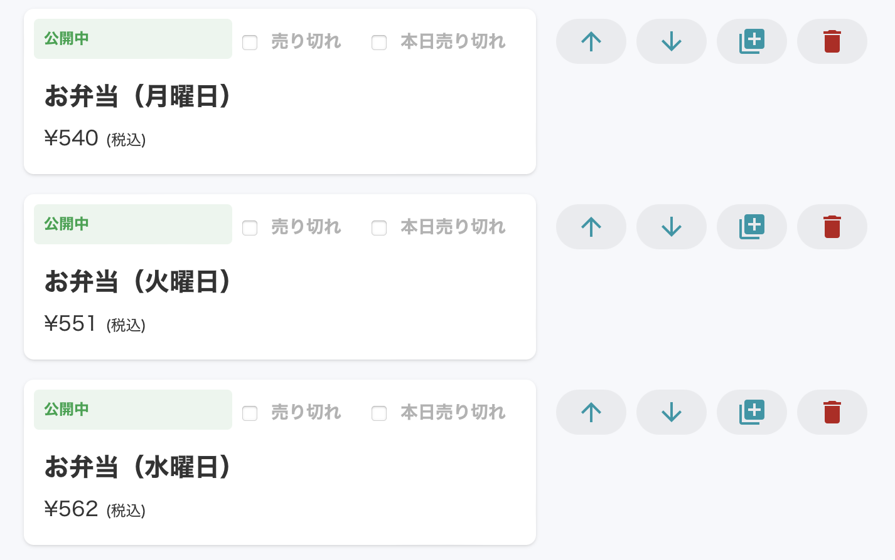
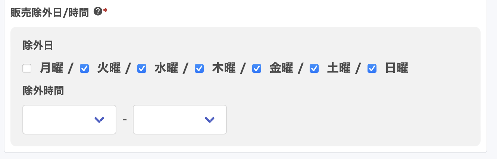

# 営業時間、受け渡し準備時間等の設定ガイド：お弁当から給食まで、多様なビジネスモデルに対応 <!-- omit in toc -->

本ガイドでは、おもちかえり.com の管理画面を使用して、様々な飲食ビジネスモデルに対応する予約システムの設定方法を詳しく解説します。お弁当の事前注文から給食の一括予約、平日限定メニューの設定まで、具体的な事例を紹介します。

受け渡し準備時間、営業時間、販売除外日時などの基本設定から、より複雑な予約管理まで紹介します。
例えば、「3日前の15:00までに注文、当日11:30に提供」といった具体的なケースの設定方法を step-by-step で紹介します。

本ガイドを活用することで、あなたの店舗に最適な予約システムを構築し、業務効率の向上と顧客満足度の増加を実現できます。

- [1. 設定場所](#1-設定場所)
	- [1.1. 受け渡し準備時間、前日受付](#11-受け渡し準備時間前日受付)
	- [1.2. 営業時間](#12-営業時間)
	- [1.3. 販売除外日 / 時間](#13-販売除外日--時間)
- [2. 設定事例](#2-設定事例)
	- [2.1. 事例1 - 3日前15:00 までに注文する → 当日 11:30 受け渡し](#21-事例1---3日前1500-までに注文する--当日-1130-受け渡し)
	- [2.2. 事例2 - 営業時間8:00-17:00 \& 当日8:00までに注文 → 当日 11:30 受け渡し](#22-事例2---営業時間800-1700--当日800までに注文--当日-1130-受け渡し)
	- [2.3. 事例3 - 毎週水曜日 15:00 までに翌週分の一括注文](#23-事例3---毎週水曜日-1500-までに翌週分の一括注文)
	- [2.4. 事例4 - 平日のみ販売する商品を設定する](#24-事例4---平日のみ販売する商品を設定する)
	- [2.5. 事例5 - ランチタイム等のピーク時は避けたい商品を設定する](#25-事例5---ランチタイム等のピーク時は避けたい商品を設定する)
	- [2.6. 事例6 - 曜日ごとに異なる値段のお弁当を設定する](#26-事例6---曜日ごとに異なる値段のお弁当を設定する)
- [3. 全体を通した特記事項](#3-全体を通した特記事項)
	- [3.1. 制限事項](#31-制限事項)
	- [3.2. キャンセルの期限](#32-キャンセルの期限)

# 1. 設定場所
## 1.1. 受け渡し準備時間、前日受付
`管理画面TOP > 対象店舗 > 店情報の変更` の「受け渡し予定時刻設定」項目で設定します。

- 受け渡し準備時間(注文が入ってから受け渡しまでの最短時間)
  - 分単位 6日以内の時間を指定してください
  - 「提供可能時刻 - 注文締切時刻」を計算し、分単位で登録します
  - 日付を跨ぐ計算の場合は、Excel、Google Spread Sheet 等で計算すると簡便に計算可能です

- 前日受付 (いつから注文を受け付けるか)
  - 選択式です
    - 当日のみ予約可能
    - 1日前から
    - 2日前から
    - 3日前から
    - 4日前から
    - 5日前から
    - 6日前から
    - 7日前から
    - 2週間前から
    - 3週間前から
    - 2ヶ月前から
    - 3ヶ月前から

## 1.2. 営業時間
`管理画面TOP > 対象店舗 > 店情報の変更` の「営業日時設定」項目で設定します。

- 曜日ごとに設定します
- 2つの時間帯を入れることができます
  - ランチ営業、ディナー営業を想定して2つの時間帯を登録できます
  - ランチ営業のみ、またはディナー営業のみの場合は上段のみ登録してください

## 1.3. 販売除外日 / 時間
`管理画面TOP > 対象店舗 > メニュー > 対象メニュー` の「商品の注文可能時間設定」項目で設定します。

- 除外日
  - 曜日ごと（複数選択可）
- 除外時間
  - 30分単位で範囲指定（例: 10:00AM〜11:30AM）

# 2. 設定事例
## 2.1. 事例1 - 3日前15:00 までに注文する → 当日 11:30 受け渡し
### 運用例
- 給食の注文集計
- 毎日 11:30 に受け渡し
- 7日前〜3日前 15:00 までに注文

### 設定方法
リードタイムと営業時間を組み合わせて設定します。

- リードタイム（`管理画面TOP > 対象店舗 > 店情報の変更` の「受け渡し予定時刻設定」の項目で設定します）
  - 受け渡し準備時間: 4110 分
    - 計算方法  
      具体的な日付を7/19(金) 15:00に締め切って、7/22(月) 11:30 に渡すとします。  
      注文締め切りから受け渡しまでは、68.5時間(19日(金)9時間、20日(土) 〜21日(日) 24時間*2、22日(月) 11時間30分)あるのでこれを分単位に変換して 68.5時間 * 60分/時間 = 4110分 
  - 前日受付: 7日前から予約可能
- 営業時間（`管理画面TOP > 対象店舗 > 店情報の変更` の「営業日時設定」の項目で設定します）
  - 営業時間: 月曜日〜金曜日 11:30〜11:35
- メニュー
  - 指定なし

### 特記事項
- 提供日毎に消費者は注文する必要がある

## 2.2. 事例2 - 営業時間8:00-17:00 & 当日8:00までに注文 → 当日 11:30 受け渡し
### 運用例
- 営業時間 8:00-17:00
- 毎日 11:30 からお弁当の販売開始
  - 7日前〜当日 8:00 までに注文

### 設定方法
リードタイムと営業時間、メニュー設定を組み合わせて設定します。

- リードタイム（`管理画面TOP > 対象店舗 > 店情報の変更` の「受け渡し予定時刻設定」の項目で設定します）
  - 受け渡し準備時間: 210 分
    - 計算方法 - {11:30 - 8:00} * 60 = 210
  - 前日受付: 7日前から予約可能
- 営業時間（`管理画面TOP > 対象店舗 > 店情報の変更` の「営業日時設定」の項目で設定します）
  - 営業時間: 月曜日〜金曜日 8:00-17:00
- メニュー（`管理画面TOP > 対象店舗 > メニュー > 対象メニュー` の「商品の注文可能時間設定」項目で設定します）
  - 販売除外日 / 時間（すべての商品に対して以下を設定します）
    - 除外時間: 8:00 AM〜11:30 AM  
      

### 特記事項
- 除外時間は店舗営業開始時刻から販売開始時刻までを指定します

## 2.3. 事例3 - 毎週水曜日 15:00 までに翌週分の一括注文
- 運用例
	- 給食の注文集計
	- 毎日 11:30 に給食
  - 月曜日〜水曜日 15:00 までの間に翌週分の一括注文
    - 例 7/15(月)〜7/19(水) 15:00 までの間に 7/22(月)〜7/26(金) の注文を受け付ける

- 設定方法
  - 受け渡し準備時間: 6990 分
    - 計算方法  
			具体的な日付を7/17(水) 15:00に締め切って、7/22(月) 11:30 にわたすとします。  
			注文締め切りから受け渡しまでは、116.5時間(17(水)9時間、18日(木) 〜21日(日) 24時間*4、22日(月) 11時間30分)あるのでこれを分単位に変換して 116.5時間 * 60分/時間 = 6990分 

  - 前日受付: 7日前から予約可能
  - 営業時間: 月曜日 11:30AM 〜 12:00PM
  - メニュー
    - 商品名: 曜日を入れた商品名にする
    - 販売除外日 / 時間: 指定なし

- 特記事項
  - 一括注文になるため、特定曜日だけキャンセルしたいという消費者の要望には応えられない

## 2.4. 事例4 - 平日のみ販売する商品を設定する
- 運用例
	- 営業時間 毎日 8:00-20:00
	- 平日のみ販売する商品がある
  - 受け渡し準備時間 30分
  - 前日受付: 当日のみ予約可能

- 設定方法
  - 受け渡し準備時間: 30 分
  - 前日受付: 当日のみ予約可能
  - 営業時間: 毎日 8:00-20:00
  - メニュー
    - 平日のみ販売する商品
      - 商品名: 指定なし
      - 販売除外日 / 時間
        - 販売除外日: 土日にチェックを入れる
				

    - 毎日販売する商品
      - 商品名: 指定なし
      - 販売除外日 / 時間: 指定なし

- 特記事項
  - 消費者からの見え方
		

## 2.5. 事例5 - ランチタイム等のピーク時は避けたい商品を設定する
- 運用例
	- 営業時間 毎日 8:00-20:00
	- 特定商品のみ 11:30-13:30 受け渡しをしない
  - 受け渡し準備時間 30分
  - 前日受付: 当日のみ予約可能

- 設定方法
  - 受け渡し準備時間: 30 分
  - 前日受付: 当日のみ予約可能
  - 営業時間: 毎日 8:00-20:00
  - メニュー
    - 通常商品
      - 商品名: 指定なし
      - 販売除外日 / 時間: 指定なし

    - ピーク時を避ける商品
      - 商品名: 指定なし
      - 販売除外日 / 時間
        - 除外時間: 11:30 AM〜13:30 PM  
				

- 特記事項
  - 消費者からの見え方（商品選ぶ時）
		
  - 消費者からの見え方（受け渡し時刻を設定する時）
		

## 2.6. 事例6 - 曜日ごとに異なる値段のお弁当を設定する
- 運用例
	- 毎日 11:30 からお弁当の販売開始
	- 毎日 8:00-20:00
  - 7日前〜当日 8:00 までに注文

- 設定方法
  - 受け渡し準備時間: 210 分
    - 計算方法 - {11:30 - 8:00} * 60 = 210
  - 前日受付: 7日前から予約可能
  - 営業時間: 毎日 8:00-20:00
  - メニュー
    - 商品名: 曜日ごとに商品を用意する  
			

    - 販売除外日 / 時間: 販売曜日以外にチェックを入れる
			

- 特記事項
  - 異なる曜日のお弁当をカートに入れても、消費者は注文できません

# 3. 全体を通した特記事項
## 3.1. 制限事項
1営業日前の15:00までといった設定には対応しておりません。  
しかし、土日祝日構わず前日15:00 までといった設定は可能です。
もしくは締切時刻を土日を挟んでも大丈夫な3日前の15:00までといった設定をしていただけると幸いです。

## 3.2. キャンセルの期限
注文ステータスによってキャンセル可否が変わります。  
また、オンライン支払いと受け取り払いではキャンセルできる注文ステータスが異なります。

|注文ステータス   | オンライン支払い | 受け取り払い    | 
|:---          |:---           |:---           | 
|注文済み       | キャンセル可     | キャンセル可    | 
|受付済み       | 不可            | キャンセル可    | 
|受け渡し準備完了| 不可            |  不可         | 
|受け渡し完了   |  不可           |  不可          | 
