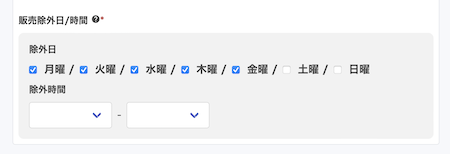

# 商品設定の活用方法：オプション、ランチ/ディナー切り替え、販売除外日/時間 <!-- omit in toc -->

本記事では、「オプション」「ランチ/ディナーの自動切り替え」「販売除外日/時間」について詳しく解説します。
これらの機能を効果的に利用することで、お客様のニーズに柔軟に対応しながら、効率的な店舗運営を実現できます。

各機能の具体的な設定方法と活用例を、ラーメン店やカレー店などの実例を交えて紹介します。
オプション設定による商品のカスタマイズ、時間帯による価格変更、特定日時の販売制限など、実践的なテクニックをステップバイステップで解説します。本記事の情報を活用し、あなたの店舗の運用を最適化しましょう。

- [1. 設定項目](#1-設定項目)
	- [1.1. オプション](#11-オプション)
	- [1.2. 商品の注文可能時間設定](#12-商品の注文可能時間設定)
- [2. オプション活用方法](#2-オプション活用方法)
	- [2.1. 設定例1 - ラーメン](#21-設定例1---ラーメン)
	- [2.2. 設定例2 - カレー](#22-設定例2---カレー)
- [3. ランチ/ディナーの自動切り替え活用方法](#3-ランチディナーの自動切り替え活用方法)
	- [3.1. ランチのみ商品、ディナーのみ商品の設定方法](#31-ランチのみ商品ディナーのみ商品の設定方法)
	- [3.2. 同一商品でランチ/ディナーの価格を変更する方法](#32-同一商品でランチディナーの価格を変更する方法)
- [4. 販売除外日 / 時間活用方法](#4-販売除外日--時間活用方法)
	- [4.1. 土日のみ販売する方法](#41-土日のみ販売する方法)
	- [4.2. 特定の時間帯を除いて販売する](#42-特定の時間帯を除いて販売する)

# 1. 設定項目
この記事では以下の設定項目を利用します。

## 1.1. オプション
- トッピングや、大盛りなどの商品のオプションを指定します。二択や三択の場合、半角カンマで区切ってください(例:「チキン, ポーク, 豆腐」)。有料オプションの場合には、最後に(+100)のように値段を指定してください(例：「普通盛り,大盛り (+150),特盛(+300)」)

## 1.2. 商品の注文可能時間設定
### ランチ/ディナーの自動切り替え <!-- omit in toc -->
- 設定箇所1
  - 商品ごとに設定します。
  - ランチのみ販売、ディナーのみ販売、ランチ/ディナー両方販売の3種類の設定が可能です。  
	- ランチ/ディナーの両方をチェックしている、もしくは両方をチェックしていない場合には、ランチ/ディナーの両方で注文可能となります。  

- 設定箇所2 
  - 飲食店設定で「ランチ/ディナーの自動切り替え」を設定します
  - 各曜日の営業時間を設定してご利用ください。  
    

### 販売除外日/時間   <!-- omit in toc -->
- 商品の販売できない日、販売できない時間帯を指定します。どちらか一方、もしくは両方を設定可能です。  
- 設定しない場合は、営業日のいつでも注文可能となります。

# 2. オプション活用方法
## 2.1. 設定例1 - ラーメン
- やりたいこと
  - 麺の量を選んでもらう。麺の量に応じて値段を変える。
    - 普通盛り、大盛りなら +108円、特盛なら +216円
  - トッピングを選んでもらう。トッピングごとに値段を変える。
    - 味玉 +108円、チャーシュー +216円、など
- 設定方法
  - 商品
    - オプション設定1: 普通盛り, 大盛り(+100), 特盛(+200)
    - オプション設定2: 味玉(+100)
    - オプション設定3: チャーシュー(+200)
    - オプション設定4: ネギ(+100)

- お客様画面（商品選択画面）  
  

- お客様画面（カート画面）  
  

- 設定画面  
  

## 2.2. 設定例2 - カレー
- やりたいこと
  - ご飯の量を選んでもらう。ご飯の量に応じて値段を変える。
    - 普通盛り、大盛りなら +108円、特盛なら +216円、半ライスなら -54円
  - 辛さを選んでもらう。辛さに応じて追加料金になる。
    - 甘口、中辛、辛口、激辛 +108円

- 設定方法
  - 商品
    - オプション設定1: 普通盛り, 大盛り(+100), 特盛(+200), 半ライス(-50)
    - オプション設定2: 甘口, 中辛, 辛口, 激辛(+100)

- お客様画面（商品選択画面）  
  

- お客様画面（カート画面）  
  

- 設定画面（商品）  
  

# 3. ランチ/ディナーの自動切り替え活用方法
## 3.1. ランチのみ商品、ディナーのみ商品の設定方法
- やりたいこと
  - ランチ営業時間、ディナー営業時間を設ける
  - 同一商品を別の価格帯で販売する

- 設定方法
  - 商品グループ
    - ランチ/ディナー別々に設定する
  - 商品
    - 商品名: 商品L
      - ランチのみ
    - 商品名: 商品D
      - ディナーのみ

- お客様画面（商品選択画面）  
	左 ランチ、右 ディナー
	  

- 設定画面
  - グループ  
		  

	- ランチ商品  
		  

  - ディナー商品   
		  

## 3.2. 同一商品でランチ/ディナーの価格を変更する方法
- やりたいこと
  - ランチ営業時間、ディナー営業時間を設ける
  - 同一商品を別の価格で販売する

- 設定方法
  - 商品グループ
    - ランチ/ディナー共通とする
  - 商品
    - 商品名: 商品A
      - 価格X
      - ランチのみ
    - 商品名: 商品A
      - 価格X
      - ディナーのみ

- お客様画面（商品選択画面）
  - ランチ  
		  

  - ディナー  
		  

- 設定画面  
  - グループ  
	  

	- 商品  
	  

# 4. 販売除外日 / 時間活用方法
## 4.1. 土日のみ販売する方法
- やりたいこと
  - 特定商品を土日のみ販売する

- 設定方法
  - 商品
    - 除外日 月曜〜金曜にチェックを入れる

- お客様画面（商品選択画面）  
	  

- 設定画面  
	  

## 4.2. 特定の時間帯を除いて販売する
- やりたいこと
  - ランチタイムの混雑を軽減させる施策
    - 早割ランチ定食 - 11:50 までの受け渡しでお得なランチ定食
    - 遅割ランチ定食 - 13:10 以降の受け渡しでお得なランチ定食
  - ランチタイムの提供が難しい商品を設定する

- 設定方法
  - 商品
    - 販売除外時間を設定する

- お客様画面（商品選択画面）  
	  

- 設定画面
  - 早割ランチ定食  
		  

  - 遅割ランチ定食  
		  

  - ランチタイムの提供が難しい商品を設定する  
		  
