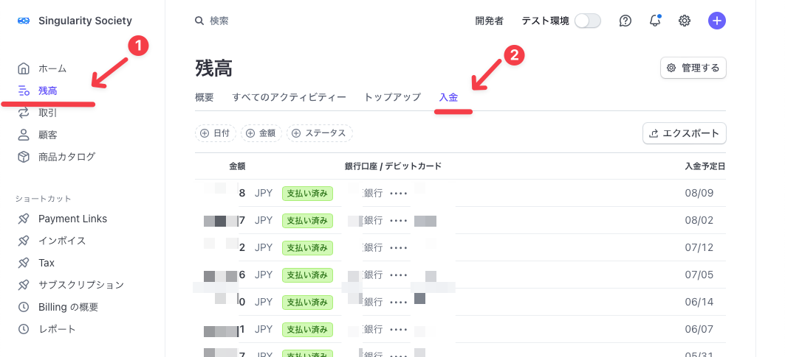

# オンライン決済(Stripe)利用時の入金スケジュールの確認と設定方法について <!-- omit in toc -->

Stripeのダッシュボードを利用すれば、入金予定日の確認やスケジュールの設定が簡単に行えます。  
本資料では、具体的な確認手順や設定方法、日本国内の入金速度について詳しく解説します。効率的な資金管理のため、ぜひご参照ください。

- [1. 入金予定日の確認方法](#1-入金予定日の確認方法)
- [2. 入金スケジュールの設定](#2-入金スケジュールの設定)
- [3. 入金スケジュールに関する説明サイト](#3-入金スケジュールに関する説明サイト)
	- [3.1. 入金スケジュール](#31-入金スケジュール)
	- [3.2. 入金速度](#32-入金速度)
	- [3.3. 日本国の入金速度](#33-日本国の入金速度)

# 1. 入金予定日の確認方法
以下のURLから入金予定日を確認することができます。

https://dashboard.stripe.com/payouts

ダッシュボードから上記URLに行くためには以下の通り操作します。
1. 「残高」を選択
2. 「入金」を選択

  

# 2. 入金スケジュールの設定
以下のURLから入金スケジュールの設定が可能です。

https://dashboard.stripe.com/settings/payouts

  

# 3. 入金スケジュールに関する説明サイト
## 3.1. 入金スケジュール

入金スケジュールに関する詳しい説明は以下に記載されています。  
https://docs.stripe.com/payouts#payout-schedule

## 3.2. 入金速度

入金速度に関する詳しい説明は以下に記載されています。  
https://docs.stripe.com/payouts#payout-speed

## 3.3. 日本国の入金速度

国によって設定されており、日本国においては4営業日前に締めるとのことです。  
https://docs.stripe.com/payouts#standard-payout-timing

  
