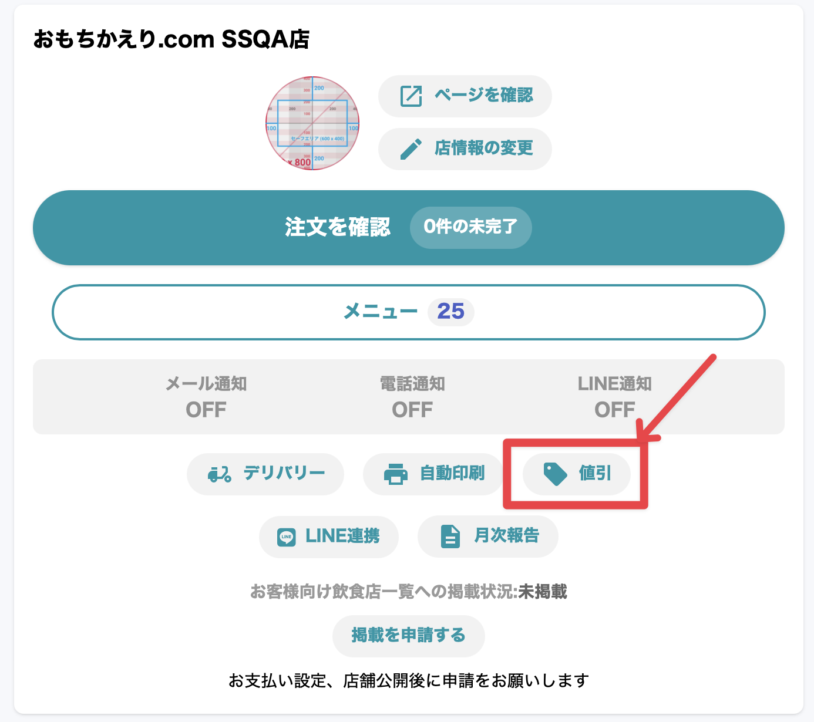
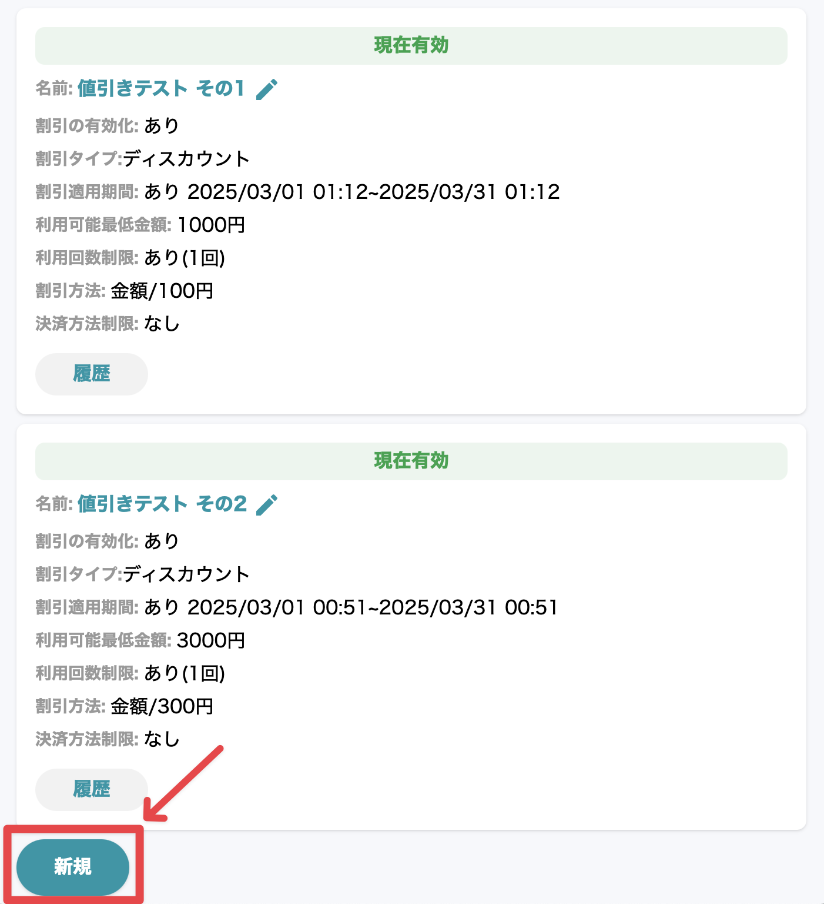
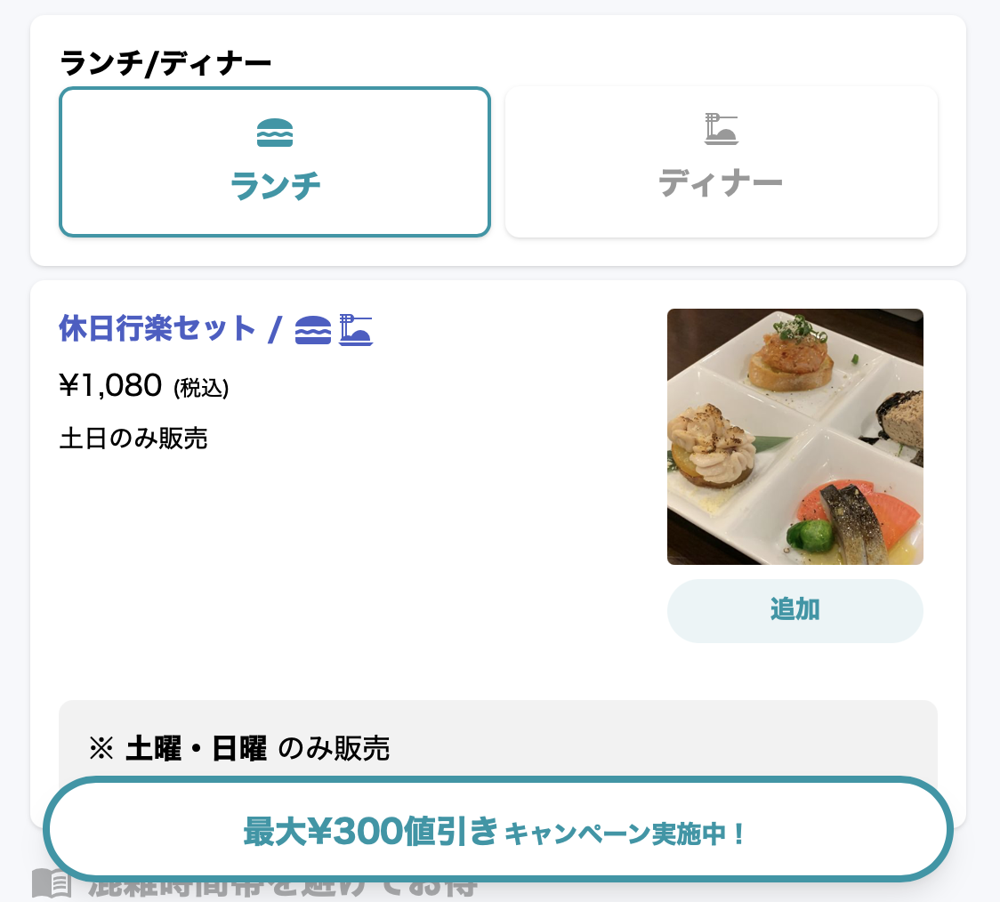
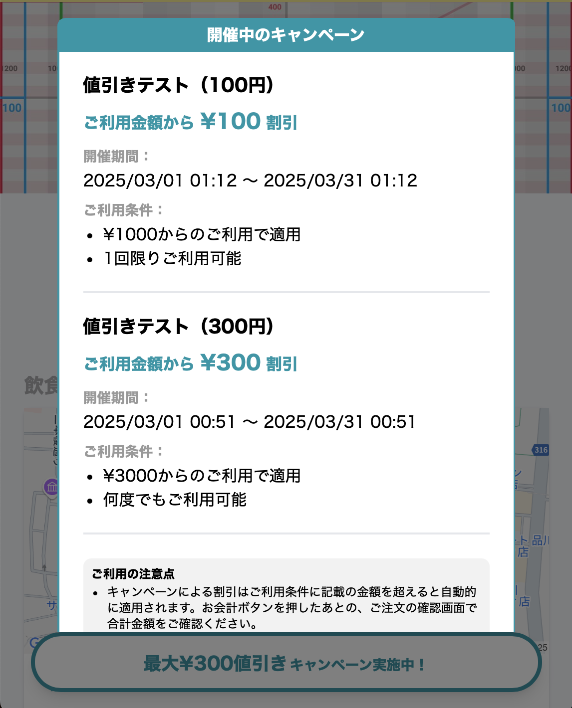
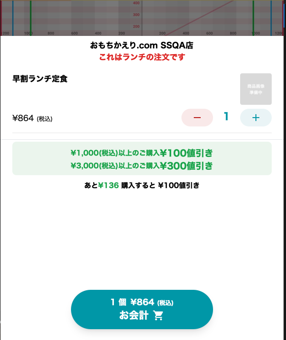
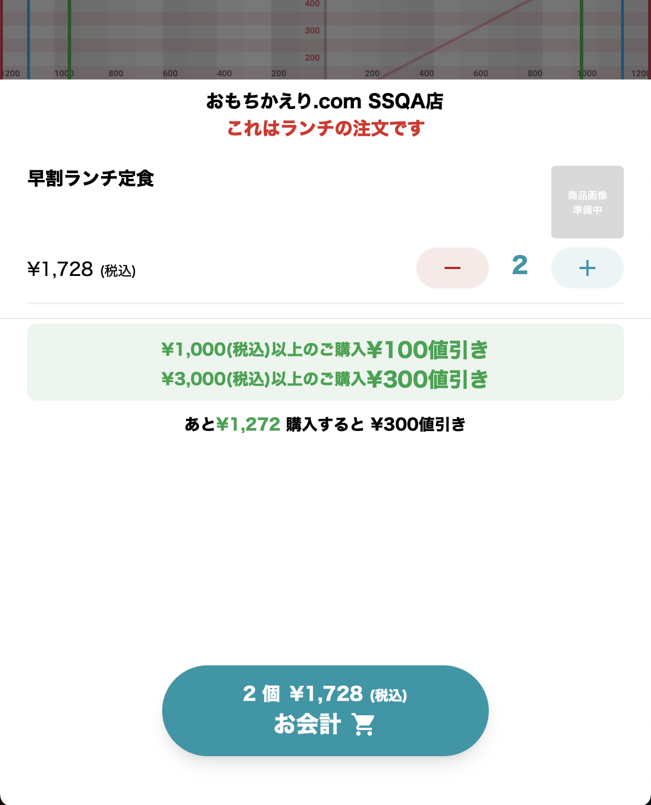
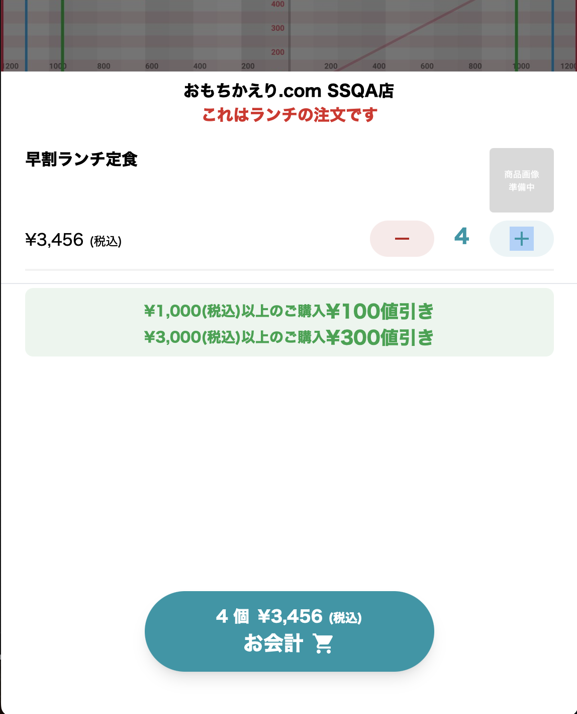
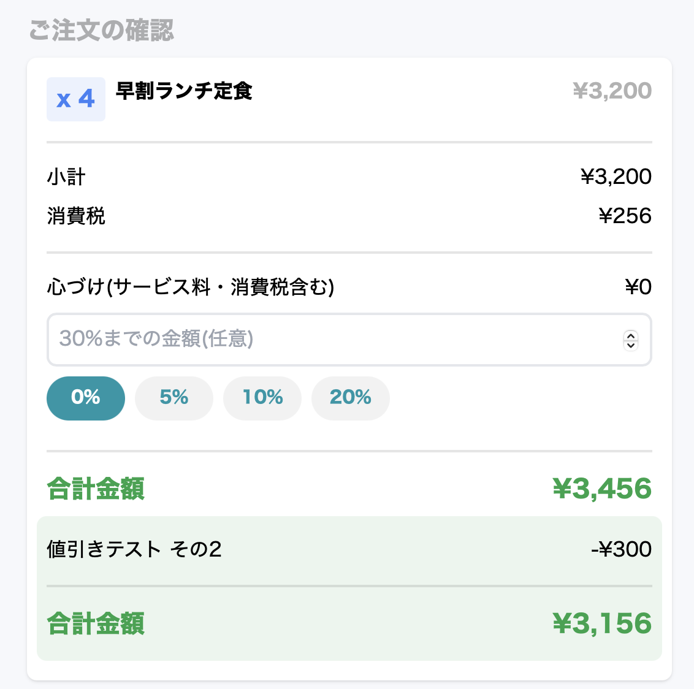
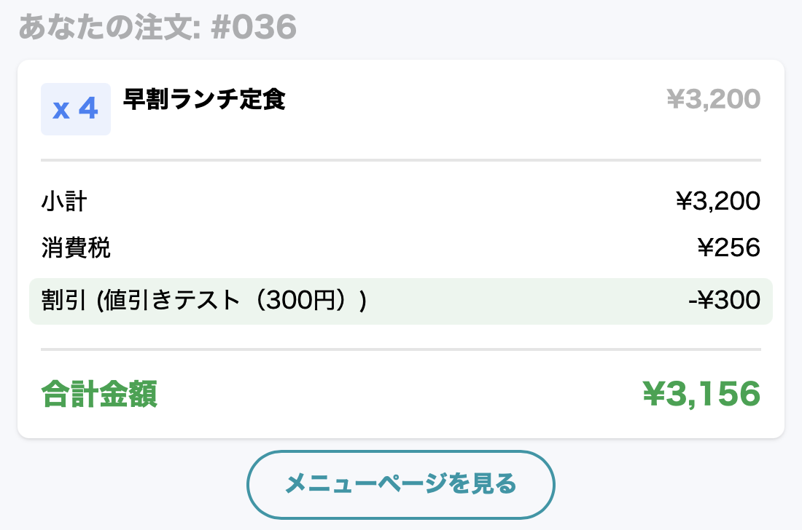

# 値引き機能  <!-- omit in toc -->

- [1. 機能概要](#1-機能概要)
- [2. 管理画面での設定](#2-管理画面での設定)
	- [2.1. 店舗ごとの設定](#21-店舗ごとの設定)
	- [2.2. 設定一覧](#22-設定一覧)
	- [2.3. 設定項目](#23-設定項目)
	- [2.4. 注意点](#24-注意点)
	- [2.5. 履歴の管理](#25-履歴の管理)
- [3. お客様（消費者）画面](#3-お客様消費者画面)
	- [3.1. 店舗トップページ](#31-店舗トップページ)
		- [3.1.1. フローティングボタン](#311-フローティングボタン)
	- [3.2. カート画面](#32-カート画面)
	- [3.3. 注文確認画面](#33-注文確認画面)
	- [3.4. 注文確定画面](#34-注文確定画面)
- [4. まとめ](#4-まとめ)

## 1. 機能概要
本機能では、各店舗が独自の値引を設定できる仕組みを提供しています。  
割引の種類や適用条件を柔軟に設定することで、特定の購入金額や支払い方法を満たしたお客様に対し、自動的に金額割引や割引率を適用し、販売促進やリピーター獲得に活用できます。  
割引設定は管理画面から簡単に行うことができ、お客様の適用履歴も確認可能です。

---

## 2. 管理画面での設定
### 2.1. 店舗ごとの設定
- 割引は店舗ごとに設定できます。

### 2.2. 設定一覧
- 値引き一覧の表示
  - 「現在有効」と表示されている値引きが適用されます
  - お客様の使用履歴を確認できます
  - 「名前」を押すと編集画面へ遷移します
- 「新規」作成ボタン

### 2.3. 設定項目
| 項目 | 説明 |
|------|------|
| **名前** | 割引の名前を自由に設定可能（お客様側にも表示されます） |
| **割引の有効化** | ONにすると対象の割引が有効化されます |
| **割引タイプ** | ディスカウントのみ |
| **割引適用期間** | 設定なし / 開始日時・終了日時を設定 |
| **利用可能最低金額 (税込)** | ¥0以上で設定可能 |
| **利用回数制限** | 1回のみ / 無制限 |
| **割引方法** | 金額割引（¥○○） / 割引率（○○%） |
| **決済方法制限** | 事前カード決済 / 受け取り払い / 制限なし |

### 2.4. 注意点
- 条件に一致する割引はすべて有効となります。
- 複数の割引が適用可能な場合は、最大の割引が適用されます。
- 同時に複数の割引は適用されません。
- 割引額と割引率を同時期に混在させずに設定してください。

### 2.5. 履歴の管理
| 項目 | 説明 |
|------|------|
| **利用者** | 対象店舗の利用者履歴ページへ遷移 |
| **注文番号** | 注文詳細ページへ遷移 |
| **注文日** | YYYY/MM/DD hh:mm |
| **合計金額** | 割引前の合計金額 |
| **割引** | 適用された割引額 |

---

## 3. お客様（消費者）画面

### 3.1. 店舗トップページ
#### 3.1.1. フローティングボタン
- カートが空のときに表示され、キャンペーン情報を告知します。
- 表示内容例：
  - **最大 nn% / ¥nnn 値引き キャンペーン実施中！**

- ボタンをタップするとキャンペーン一覧を表示するモーダルが開きます。
  - ご利用の注意点は以下が表示されます。  
	> **ご利用の注意点**  
	> キャンペーンによる割引はご利用条件に記載の金額を超えると自動的に適用されます。お会計ボタンを押したあとの、ご注文の確認画面で合計金額をご確認ください。  
	> キャンペーンは1つのみご利用できます。複数のキャンペーンに当てはまる場合は割引額が最大となるキャンペーンが適用されます。

### 3.2. カート画面
- 現在開催中のキャンペーンを一覧表示。
- 「あと、¥nnn 購入すると nn% / ¥nnn 値引き」が表示されます。

#### 表示例  <!-- omit in toc -->
**店舗側**  <!-- omit in toc -->
- 1000円以上で 100円引き
- 3000円以上で 300円引き

**お客様（消費者）側**  <!-- omit in toc -->
- 商品選択画面
  - 最大¥300値引きキャンペーン実施中

- モーダル内表示
  - カート内 1000円未満  

  - カート内 1000円〜3000円未満  

  - カート内 3000円以上  

### 3.3. 注文確認画面
適用されたキャンペーン名および割引金額が表示されます。  
合計金額は値引き後の金額が表示されます。

### 3.4. 注文確定画面
- 注文確認画面と同様に適用されたキャンペーン情報を表示。

---

## 4. まとめ
本機能により、店舗ごとに柔軟な割引設定が可能となり、販売促進に活用できます。特に、**適用条件の明確化** と **割引の最大適用ロジック** に注意しながら設定を行ってください。

